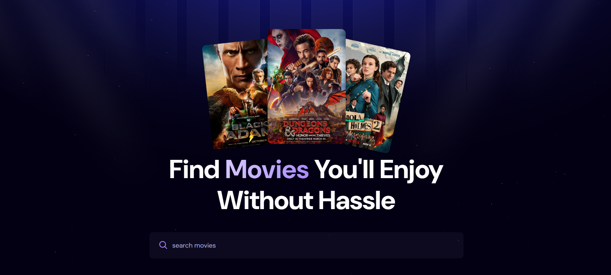
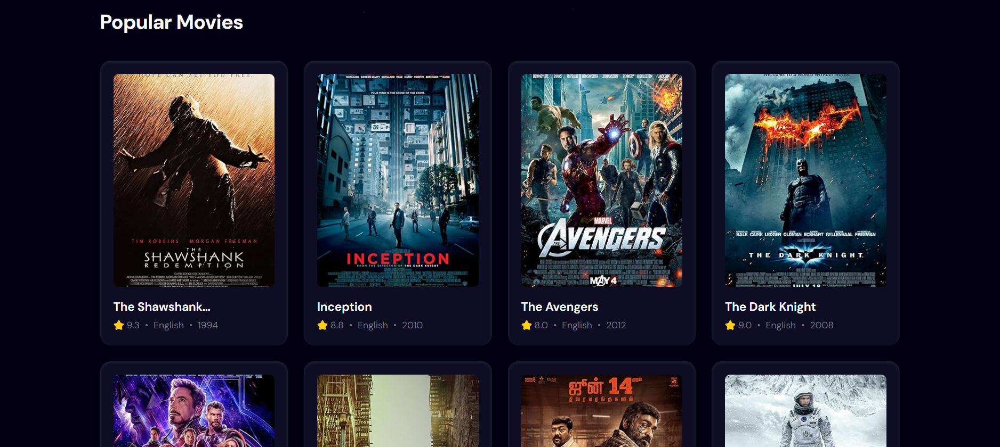
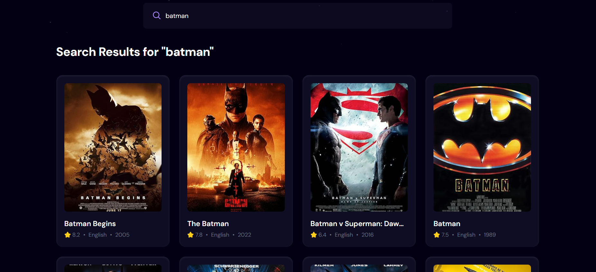
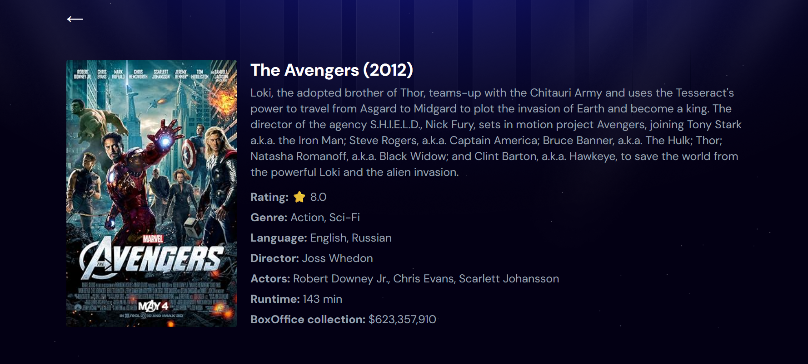

# 🎬 MoviesHub

**MoviesHub** is a sleek, modern movie discovery web app built with **React.js**, **Vite**, and **Tailwind CSS**. It uses the **OMDb API** to let users search and explore details of popular movies with an elegant and responsive UI.

  
  
  
  

---

## 🚀 Features

- 🔍 Real-time movie search with debounce functionality
- 🎞️ Display of popular movies using IMDb IDs
- ⭐ IMDb ratings, release year, and language shown
- 📂 Fallback poster image for unavailable movies
- 💡 Responsive layout with Tailwind CSS
- 🧠 Built using modern React hooks (`useState`, `useEffect`, `useDebounce`)
- ✨ Movie Details Page – Click a movie card to see plot, director, genre, cast, runtime, and more!
- ⚡ Smooth navigation with react-router-dom
- 🌀 loading spinners and improved UX on data fetching

---

## 🔧 Tech Stack

- ⚛️ React.js (Vite)
- 🎨 Tailwind CSS
- 🌐 OMDb API
- 🧰 React Hooks
- 🧭 React Router

---

